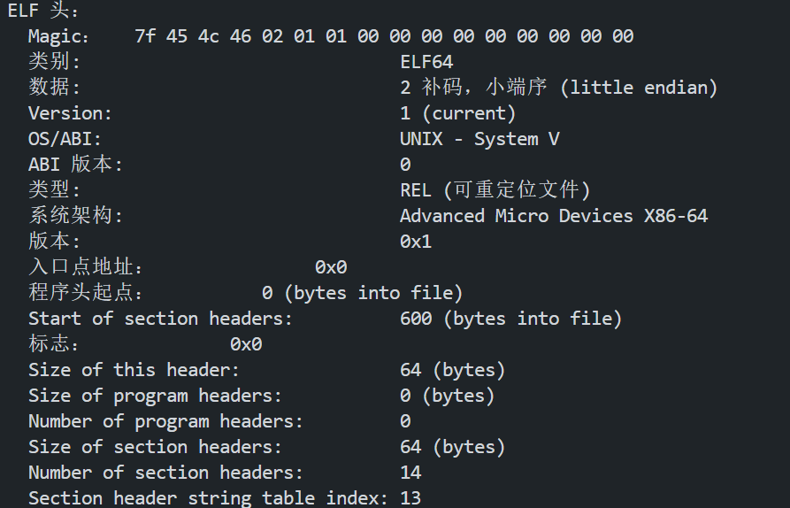
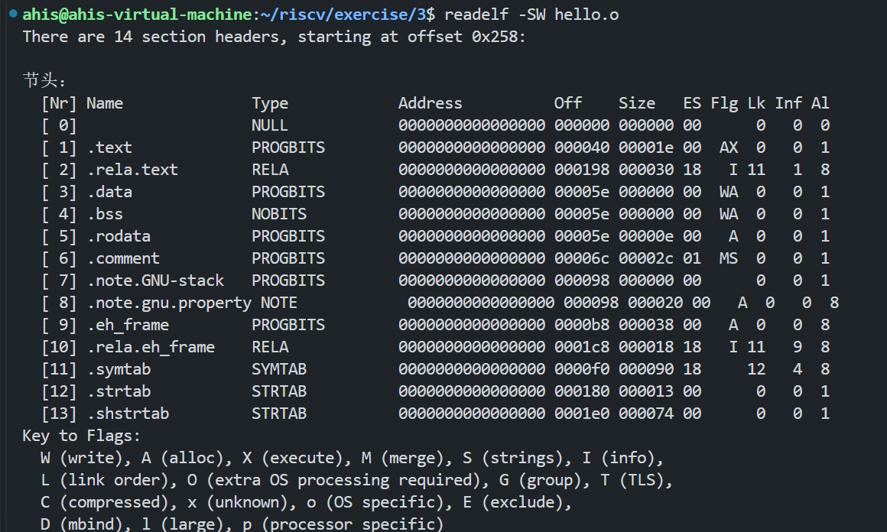
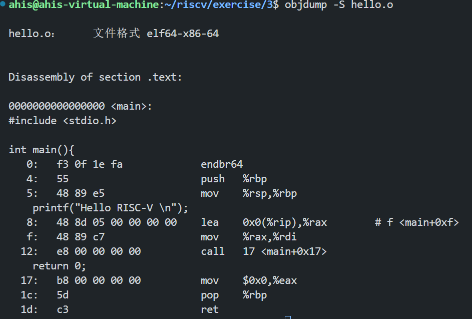

#### 练习3-1
使⽤ gcc 编译代码并使⽤ binutils ⼯具对⽣成的⽬标文件和可执⾏文件（ELF 格式）进⾏分析。具体要求如下：
编写⼀个简单的打印 “hello world！” 的程序源文件：hello.c
- gcc -c hello.c
对源文件进⾏本地编译，⽣成针对⽀持 x86_64 指令集架构处理器的⽬标文件 hello.o。
查看 hello.o 的文件的文件头信息。
- readelf -h hello.o

查看 hello.o 的 Section header table。
- readelf -SW hello.o #加W是方便看信息，不然信息不在一行

对 hello.o 反汇编，并查看 hello.c 的 C 程序源码和机器指令的对应关系
- objdump -S hello.o #这个.o最好是gcc -c -g 带调试信息的



### 练习3-2
请问编译为 .o 文件后，global_init, global_const, static_var, static_var_uninit, auto_var 这些变
量分别存放在那些 section ⾥，"hello world!\n" 这个字符串⼜在哪⾥？并尝试⽤⼯具查看并验证你的猜
测。
在编译为 `.o` 文件后，不同类型的变量会被放置在不同的段（section）中。以下是对这些变量的存放位置的猜测：

**gpt的回答**

1. `global_init`：已初始化的全局变量，存放在 `.data` 段。
2. `global_const`：常量，全局只读数据，存放在 `.rodata` 段。
3. `static_var`：已初始化的静态变量，存放在 `.data` 段。
4. `static_var_uninit`：未初始化的静态变量，存放在 `.bss` 段。
5. `auto_var`：自动变量（局部变量），存放在栈中，不在 `.o` 文件的段中。
6. `"hello world!\n"`：字符串常量，存放在 `.rodata` 段。

要验证这些猜测，可以使用 `objdump` 工具查看编译后的 `.o` 文件的段信息。以下是具体步骤：

1. **编译源文件**：
   ```bash
   gcc -c 3-2.c -o 3-2.o
   ```

2. **使用 `objdump` 查看段信息**：
   ```bash
   objdump -h 3-2.o
   ```

   这将显示 `.o` 文件的段信息。

3. **使用 `objdump` 查看符号表**：
   ```bash
   objdump -t 3-2.o
   ```

   这将显示 `.o` 文件中的符号及其所在的段。

4. **使用 `objdump` 查看详细信息**：
   ```bash
   objdump -s -j .data 3-2.o
   objdump -s -j .rodata 3-2.o
   objdump -s -j .bss 3-2.o
   ```

   这将显示各个段的详细内容。

通过这些步骤，您可以验证每个变量和字符串常量的存放位置。以下是示例输出的解释：

```plaintext
Sections:
Idx Name          Size      VMA       LMA       File off  Algn
  0 .text         00000034  00000000  00000000  00000034  2**2
                  CONTENTS, ALLOC, LOAD, READONLY, CODE
  1 .data         00000008  00000000  00000000  00000068  2**2
                  CONTENTS, ALLOC, LOAD, DATA
  2 .bss          00000004  00000000  00000000  00000070  2**2
                  ALLOC
  3 .rodata       00000010  00000000  00000000  00000074  2**2
                  CONTENTS, ALLOC, LOAD, READONLY, DATA
```

在符号表中，您可以看到每个变量的符号及其所在的段。例如：

```plaintext
00000000 l    d  .data  00000000 .data
00000000 l    d  .bss   00000000 .bss
00000000 l    d  .rodata        00000000 .rodata
00000000 l    d  .text  00000000 .text
00000000 g     O .data  00000004 global_init
00000000 g     O .bss   00000004 static_var_uninit
00000000 g     O .rodata        00000004 global_const
00000000 g     F .text  00000034 main
00000000 g     O .data  00000004 static_var
```

通过这些信息，您可以确认每个变量和字符串常量的存放位置。